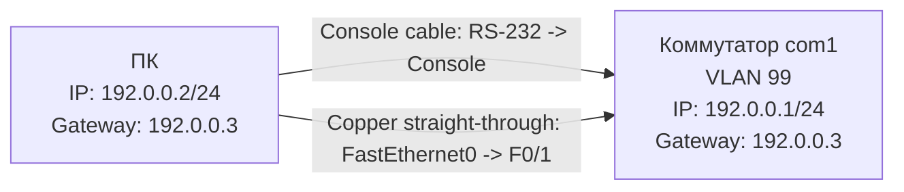

# Лабораторная работа 1. Базовая настройка коммутатора. Подключение к коммутатору

Файл стенда: `lab-01.pkt`

## Цель работы

Освоить базовые принципы работы с сетевым оборудованием Cisco, систему команд и их логику, базовые принципы настройки коммутатора, а также разные варианты подключения к коммутатору: первое подключение через консольный кабель, затем удаленное подключение через Telnet и SSH.

## Схема

В работе используется один коммутатор и один ПК.



## 1. Первичное подключение

Один конец консольного кабеля подключается к COM-порту компьютера (`RS-232`), другой — к консольному порту коммутатора (`Console`). Подключение выполняется через терминал ПК.

В Cisco Packet Tracer на ПК открывается:

```text
Desktop -> Terminal
```

Параметры подключения:

```text
тип подключения: Serial
Serial line: COM1 или COM3
Speed: 9600
```

После подключения можно перейти в режимы работы CLI:

```ios
enable
configure terminal
```

Изменение приглашения командной строки:

```text
Switch>              пользовательский режим
Switch#              привилегированный режим
Switch(config)#      режим глобальной конфигурации
```

## 2. Базовая настройка имени и безопасности

В режиме глобальной конфигурации задается имя коммутатора и базовые параметры безопасности.

```ios
hostname com1
service password-encryption
enable secret cisco
no ip domain-lookup
banner motd #access denied#
ip default-gateway 192.0.0.3
```

Пояснение команд:

| Команда | Что делает |
|---|---|
| `hostname com1` | задает имя коммутатора |
| `service password-encryption` | включает шифрование паролей |
| `enable secret cisco` | задает пароль `cisco` для привилегированного режима |
| `no ip domain-lookup` | отключает поиск по DNS при ошибочном вводе команды |
| `banner motd #access denied#` | задает предупреждающий баннер |
| `ip default-gateway 192.0.0.3` | задает шлюз по умолчанию для управления коммутатором |

После команды `hostname com1` приглашение изменяется:

```text
Switch(config)# -> com1(config)#
```

После настройки `enable secret` при входе в `enable` будет запрашиваться пароль.

Проверка:

```ios
show running-config
```

## 3. Настройка VLAN и IP-адреса управления

Создается VLAN 99 и интерфейс VLAN 99 для управления коммутатором.

```ios
vlan 99
interface vlan 99
ip address 192.0.0.1 255.255.255.0
no shutdown
exit
```

Пояснение:

| Команда | Что делает |
|---|---|
| `vlan 99` | создаем VLAN 99 |
| `interface vlan 99` | переходим в режим конфигурации интерфейса VLAN |
| `ip address 192.0.0.1 255.255.255.0` | задаем IP-адрес и маску |
| `no shutdown` | включаем интерфейс |
| `exit` | возвращаемся из режима конфигурации интерфейса |

После входа в режим интерфейса приглашение меняется:

```text
com1(config)# -> com1(config-if)#
```

После `exit`:

```text
com1(config-if)# -> com1(config)#
```

Проверить создание VLAN и IP-адрес можно командами:

```ios
show ip interface brief
show interface vlan 99
show vlan brief
show running-config
```

## 4. Настройка портов для VLAN 99

Порты коммутатора, которые должны относиться к VLAN 99, переводятся в access VLAN 99.

```ios
interface range f0/1-4
switchport access vlan 99
exit
```

Пояснение:

| Команда | Что делает |
|---|---|
| `interface range f0/1-4` | переходим сразу к диапазону интерфейсов с `f0/1` по `f0/4` |
| `switchport access vlan 99` | включаем порты в VLAN 99 |
| `exit` | выходим из режима конфигурации диапазона интерфейсов |

При входе в диапазон интерфейсов приглашение меняется:

```text
com1(config)# -> com1(config-if-range)#
```

Проверка:

```ios
show vlan brief
show running-config
```

## 5. Настройка консольной линии

Настраивается пароль на консольное подключение.

```ios
line console 0
password cisco
login
logging synchronous
exit
```

Пояснение:

| Команда | Что делает |
|---|---|
| `line console 0` | переходим в режим конфигурации консольной линии |
| `password cisco` | устанавливаем пароль для входа через консоль |
| `login` | включаем запрос пароля на аутентификацию |
| `logging synchronous` | делает так, чтобы системные сообщения не прерывали ввод команд |
| `exit` | выход из режима конфигурации линии |

Проверка:

```ios
show running-config
```

## 6. Настройка VTY-линий

Настраиваются линии удаленного доступа `vty 0 15`.

```ios
line vty 0 15
password cisco
login
logging synchronous
exit
```

Пояснение:

| Команда | Что делает |
|---|---|
| `line vty 0 15` | переходим в режим настройки VTY-линий с 0 по 15 |
| `password cisco` | задаем пароль на VTY-линии |
| `login` | включаем запрос пароля на аутентификацию |
| `logging synchronous` | системные сообщения не прерывают ввод команд |
| `exit` | выход из режима конфигурации линии |

После этого можно подключаться к коммутатору по Telnet, если:

- настроены консольная и VTY-линии;
- задан IP-адрес и шлюз управления;
- ПК находится в той же сети, что и коммутатор.

## 7. Подключение по Telnet

Сначала коммутатор соединяется с компьютером обычным сетевым кабелем:

```text
порт коммутатора: F0/1
порт ПК: FastEthernet0
```

На ПК задаются параметры:

```text
IP address: 192.0.0.2
Mask: 255.255.255.0
Default gateway: 192.0.0.3
```

Сначала проверяется связь между ПК и коммутатором через командную строку ПК:

```text
ping 192.0.0.1
```

Если вывод успешный, можно подключаться по Telnet:

```text
telnet 192.0.0.1
```

Проверить линию подключения можно командой:

```ios
show users
```

`show users` выводит активные подключения к устройству, в том числе через VTY.

## 8. Настройка SSH

Для SSH дополнительно задается доменное имя, генерируются RSA-ключи, создается локальный пользователь и на VTY включается только SSH.

```ios
ip domain-name cisco.com
crypto key generate rsa
```

При генерации ключей задается размер ключа; используется размер `1024`.

Далее создается пользователь:

```ios
username jul secret cisco
```

Настраиваются VTY-линии:

```ios
line vty 0 15
transport input ssh
login local
exit
ip ssh version 2
```

Пояснение:

| Команда | Что делает |
|---|---|
| `ip domain-name cisco.com` | задает доменное имя |
| `crypto key generate rsa` | генерирует ключи RSA |
| `username jul secret cisco` | создает локального пользователя |
| `transport input ssh` | разрешает подключение только по SSH |
| `login local` | включает локальную аутентификацию |
| `ip ssh version 2` | включает SSH версии 2 |

После `transport input ssh` по Telnet подключиться уже не получится, потому что разрешен только SSH.

Проверка подключения по SSH из командной строки:

```text
ssh -l jul 192.0.0.1
```

Проверка из SSH-клиента:

```text
Host name (or IP address): 192.0.0.1
Username: jul
```

В обоих случаях запрашивается пароль пользователя `jul`, затем выполняется подключение.

## Вывод

Освоены базовые принципы работы с сетевым оборудованием Cisco, система команд и их логика, базовые принципы настройки коммутатора. Проверены варианты подключения к коммутатору: первичное подключение через консольный кабель, удаленное подключение через Telnet и подключение через SSH.
