# Лабораторная работа 2. Принцип работы коммутатора. CAM-таблица, ARP-таблица и портовая безопасность

Файл стенда: `lab-02.pkt`

## Цель работы

Изучить принцип работы коммутатора, заполнение CAM/MAC-таблиц, работу ARP-таблиц и прохождение ICMP-пакетов через сеть из нескольких коммутаторов.

## 1. Реализовать следующую схему

В работе используются три коммутатора `COM1`, `COM2`, `COM3` и шесть ПК в одной IPv4-сети `1.0.0.0/24`.

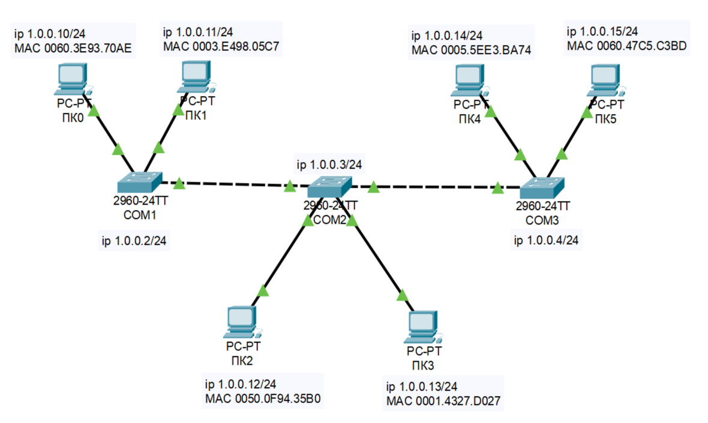

Таблица адресации из схемы:

| Устройство | IP-адрес | MAC-адрес |
|---|---|---|
| ПК0 / PC0 | `1.0.0.10/24` | `0060.3E93.70AE` |
| ПК1 / PC1 | `1.0.0.11/24` | `0003.E498.05C7` |
| ПК2 / PC2 | `1.0.0.12/24` | `0050.0F94.35B0` |
| ПК3 / PC3 | `1.0.0.13/24` | `0001.4327.D027` |
| ПК4 / PC4 | `1.0.0.14/24` | `0005.5EE3.BA74` |
| ПК5 / PC5 | `1.0.0.15/24` | `0060.47C5.C3BD` |
| COM1 / S1 | `1.0.0.2/24` | management IP |
| COM2 / S2 | `1.0.0.3/24` | management IP |
| COM3 / S3 | `1.0.0.4/24` | management IP |

## 2. Базовая настройка каждого коммутатора

После выполнения всех команд конфигурации проверяется `show running-config`. Для всех трех коммутаторов настройки аналогичны: hostname, шифрование паролей, SSH, доменное имя, пользователь `admin`, VLAN 2, access-порты и IP-адрес интерфейса VLAN 2.

Примерная логика настройки:

```ios
enable
configure terminal
service password-encryption
hostname S1
ip ssh version 2
no ip domain-lookup
ip domain-name com1.com
username admin secret cisco

interface FastEthernet0/1
 switchport access vlan 2
interface FastEthernet0/2
 switchport access vlan 2
interface FastEthernet0/3
 switchport access vlan 2
interface GigabitEthernet0/1
 switchport access vlan 2

interface Vlan2
 ip address 1.0.0.2 255.255.255.0

ip default-gateway 1.0.0.1
banner motd #access denied#
```

Для `Com1`, `Com2`, `Com3` используются полные выводы `show running-config`. Они сохранены в виде таблицы/скриншотов команд.

## 3. Проверка работы коммутатора через ping

Сначала проверяется связность между узлами. Из командной строки ПК выполняется `ping` до других ПК и до management-адресов коммутаторов.

Проверка до ПК:

```text
ping 1.0.0.15
ping 1.0.0.12
ping 1.0.0.14
```

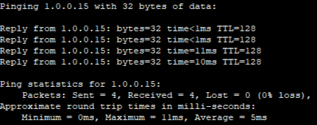

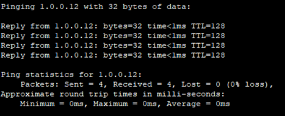

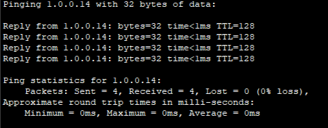

Проверка до коммутаторов:

```text
ping 1.0.0.2
ping 1.0.0.3
ping 1.0.0.4
```

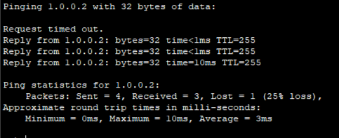

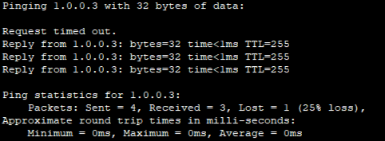

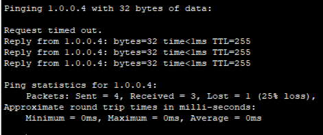

Наблюдение: первый пакет может не пройти, потому что перед ICMP-обменом выполняется ARP-запрос. После появления ARP-записи последующие ответы приходят успешно.

## 4. Работа в simulation mode

В режиме симуляции проверяется прохождение ICMP-пакетов.

Отдельно зафиксировано, что первый ping может дать `Request timed out`, а затем после ARP-разрешения ping проходит успешно.

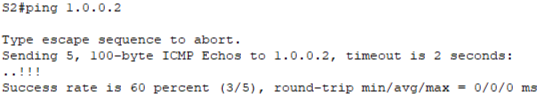

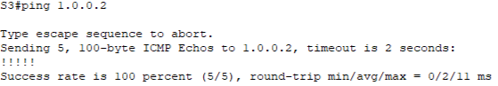

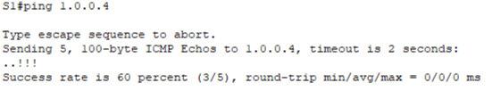

Вывод по шагу: потеря первого пакета в данном случае не означает ошибку в адресации. Это связано с тем, что устройство сначала узнает MAC-адрес получателя через ARP.

## 5. Проверка MAC/CAM-таблиц коммутаторов

На коммутаторах выполняется команда:

```ios
show mac-address-table
```

Смысл проверки: коммутатор запоминает MAC-адреса источников кадров и связывает их с портами, через которые эти кадры пришли.

MAC-таблица `S1`:

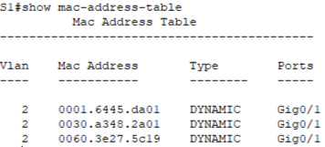

MAC-таблица `S2`:

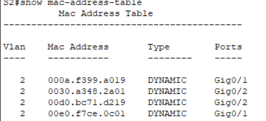

MAC-таблица `S3` до/после дополнительного обмена:

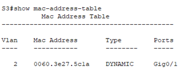

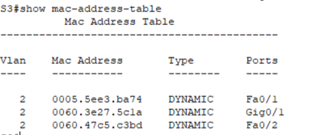

Наблюдение: после обмена трафиком таблицы содержат больше записей. Коммутатор не знает расположение всех устройств заранее, а заполняет CAM-таблицу динамически.

## 6. Проверка ARP-таблиц на ПК

На ПК выполняется команда:

```text
arp -a
```

ARP-таблица связывает IP-адреса локальных устройств с их MAC-адресами.

ARP-таблица PC0:

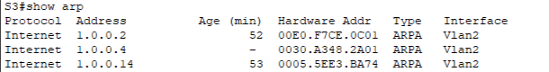

ARP-таблица PC3:

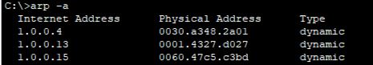

ARP-таблица PC4:

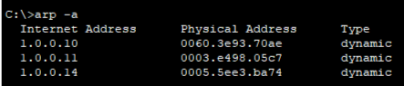

ARP-таблица PC5:

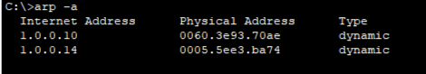

Пример пояснения для PC5: первая запись — IP-адрес ПК0 и его MAC-адрес, вторая — IP-адрес ПК4 и его MAC-адрес; записи появились после ping между устройствами.

Для `Com3` разбирается ARP-вывод: первая запись связана с IP интерфейса VLAN2 на `Com1` и его MAC-адресом, вторая — IP интерфейса VLAN2 на `Com3`, третья — IP-адрес ПК4 с его MAC-адресом.

## 7. Изменение ARP-таблицы после нового ping

Далее моделируется изменение ARP-таблицы. Выполняется ping с `PC5` до `PC1`:

```text
ping 1.0.0.11
```

После команды снова открывается ARP-таблица `PC5`.

Наблюдение: в таблицу добавляется новая связь — IP-адрес `PC1` и его MAC-адрес. Это подтверждает, что ARP-таблица изменяется по мере появления новых взаимодействий в сети.

## Вывод

В работе изучена работа коммутатора на втором уровне модели OSI. Коммутатор заполняет CAM/MAC-таблицу на основе входящих кадров. Перед отправкой IP-пакета внутри локальной сети устройство использует ARP, чтобы определить MAC-адрес получателя. Первый ping может завершаться timeout из-за ARP-разрешения, а после заполнения ARP-таблицы обмен проходит успешно.
