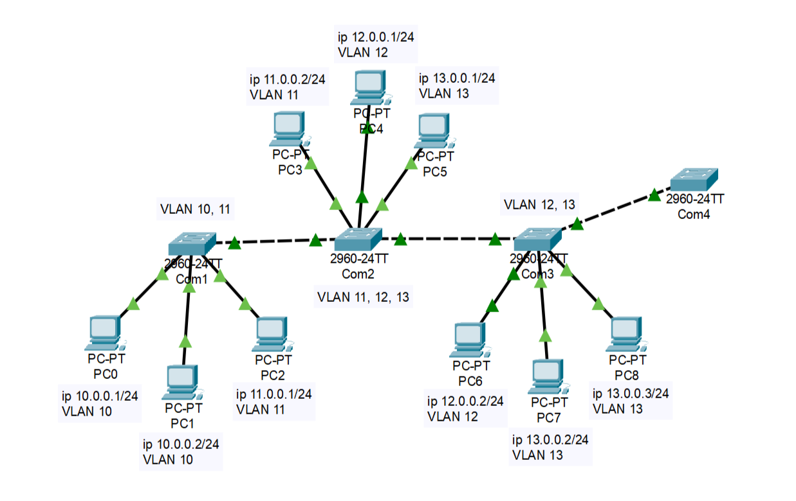

# Лабораторная работа 3. VLAN, DTP и VTP

Файл стенда: не сохранился.

## Цель работы

Изучить VLAN, режимы access/trunk, работу DTP и VTP. Проверить, как VLAN ограничивает широковещательные домены, как trunk переносит несколько VLAN и как VTP распространяет сведения о VLAN между коммутаторами.

## Схема



Адресация и VLAN из схемы:

| Устройство | IP-адрес | VLAN |
|---|---|---|
| PC0 | `10.0.0.1/24` | VLAN 10 |
| PC1 | `10.0.0.2/24` | VLAN 10 |
| PC2 | `11.0.0.1/24` | VLAN 11 |
| PC3 | `11.0.0.2/24` | VLAN 11 |
| PC4 | `12.0.0.1/24` | VLAN 12 |
| PC5 | `13.0.0.1/24` | VLAN 13 |
| PC6 | `12.0.0.2/24` | VLAN 12 |
| PC7 | `13.0.0.2/24` | VLAN 13 |
| PC8 | `13.0.0.3/24` | VLAN 13 |

По схеме:

- `Com1` работает с VLAN 10 и 11;
- `Com2` работает с VLAN 11, 12, 13;
- `Com3` работает с VLAN 12 и 13;
- `Com4` подключен к trunk и участвует в проверках VLAN/VTP.

## 1. Изучение протокола DTP

### 1.1. Проверка состояния портов у коммутаторов

На коммутаторе проверяется состояние порта `gi0/1`:

```ios
show interface gi0/1 switchport
```

В выводе отмечено:

```text
Administrative Mode: dynamic auto
Operational Mode: static access
```

Пояснение: административный режим — это режим, который предполагается настройкой. Фактический режим (`Operational Mode`) показывает, как порт реально работает сейчас. В данном случае порт фактически находится в access-режиме.

Вывод: порт работает в режиме access с возможностью перейти в другой режим при согласовании с помощью DTP.

### 1.2. Перевод порта gi0/1 в trunk

На каждом порту каждого коммутатора выполняются аналогичные действия. Порт `gi0/1` переводится в режим trunk:

```ios
configure terminal
interface gi0/1
switchport mode trunk
```

Проверка:

```ios
show interface gi0/1 switchport
show running-config
show interface trunk
```

После настройки на втором конце соединения снова проверяется состояние порта:

```ios
show interface gi0/1 switchport
```

Полученный результат:

```text
Administrative Mode: dynamic auto
Operational Mode: trunk
```

Вывод: с помощью протокола DTP порт `gi0/1` на соседнем коммутаторе самостоятельно перестроил режим работы в trunk, так как физически соединен с портом, настроенным как trunk.

### 1.3. Отключение отправки кадров DTP

На `Com1` отключается отправка DTP-кадров:

```ios
configure terminal
interface gi0/1
switchport nonegotiate
```

Проверка:

```ios
show running-config
show interface gi0/1 switchport
show dtp
```

Наблюдение: в выводе `show dtp` число интерфейсов, использующих DTP, должно уменьшиться на один. При этом trunk сохраняется, но автоматическое согласование DTP для данного порта отключено.

## 2. Настройка VLAN

Создаются VLAN 10, 11, 12 и 13.

```ios
vlan 10
vlan 11
vlan 12
vlan 13
```

Порты, к которым подключены ПК, переводятся в access-режим и добавляются в нужные VLAN.

Пример:

```ios
interface fa0/1
switchport mode access
switchport access vlan 10
```

Проверка:

```ios
show vlan brief
```

Вывод по шагу: ПК, находящиеся в одной VLAN, должны видеть друг друга, а ПК из разных VLAN без маршрутизации между VLAN взаимодействовать не будут.

## 3. Проверка связи внутри VLAN и между VLAN

Проверяется ping между ПК одной VLAN, подключенными через разные коммутаторы. Если нужная VLAN разрешена на trunk, обмен проходит.

Пример:

```text
PC0 -> ping 10.0.0.2
PC2 -> ping 11.0.0.2
PC4 -> ping 12.0.0.2
PC5 -> ping 13.0.0.2
```

Затем проверяется связь между разными VLAN.

Пример:

```text
PC0 -> ping 11.0.0.1
```

Ожидаемый результат: без межвлановой маршрутизации ping не проходит.

Вывод: VLAN разделяет сеть на разные широковещательные домены.

## 4. Ограничение VLAN на trunk

На trunk-порту задается список VLAN, которым разрешено проходить через trunk.

```ios
interface gi0/1
switchport trunk allowed vlan 10,11
```

Проверка:

```ios
show interface trunk
```

Наблюдение: если VLAN не входит в список разрешенных, трафик этой VLAN через trunk не проходит.

Вывод: allowed VLAN list ограничивает распространение VLAN между коммутаторами.

## 5. Изучение протокола VTP

VTP используется для автоматизации создания VLAN на коммутаторах.

Роли VTP:

| Режим | Смысл |
|---|---|
| `server` | создает, изменяет и удаляет VLAN; рассылает объявления при каждой новой ревизии |
| `client` | получает все VLAN и синхронизируется от сервера; создавать, изменять и удалять VLAN нельзя |
| `transparent` | независимая роль; может создавать/изменять/удалять VLAN только в своей базе; никому не передает и ни от кого не принимает изменения |

Эксперимент: добавляется `Com4`, подключается к `Com3` через порт `gi0/2`, затем настраивается как клиент.

```ios
configure terminal
vtp mode client
```

Проверка:

```ios
show vtp status
```

После этого проверяется, какие VLAN видит клиент.

Наблюдение: VLAN, созданная на server, распространяется на client. VLAN, созданная на client, не распространяется по домену.

## 6. Дополнительный эксперимент с VLAN 15

Проверялось создание дополнительной VLAN 15. Смысл эксперимента — посмотреть, где появляется новая VLAN в зависимости от роли VTP-устройства.

Проверка выполняется командами:

```ios
show vlan brief
show vtp status
```

Вывод: изменение VLAN-базы распространяется только от VTP server. Устройство в режиме client не может быть источником изменения VLAN-конфигурации домена.

## Вывод

Изучены VLAN, DTP и VTP. Проверено, что access-порт передает трафик одной VLAN, trunk-порт переносит несколько VLAN, а DTP может автоматически согласовывать trunk между соседними портами. Отключение DTP через `switchport nonegotiate` делает поведение порта более предсказуемым. VTP удобен для распространения VLAN, но является рискованным протоколом: при неправильной настройке он может распространить нежелательные изменения по сети.
