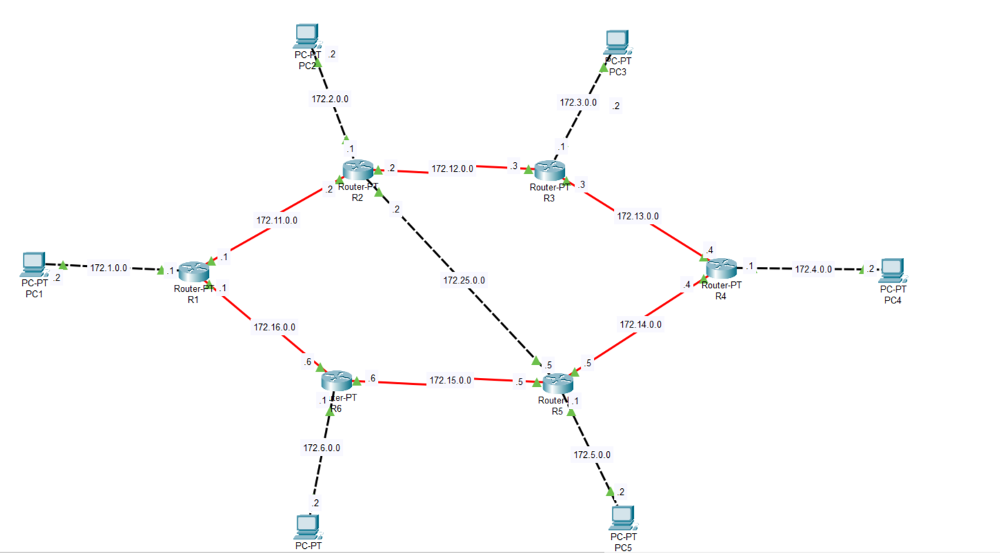
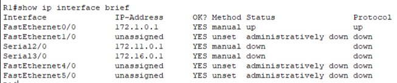
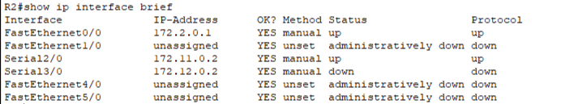
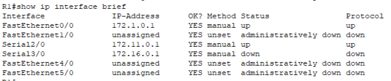
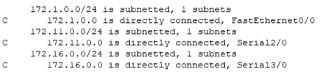
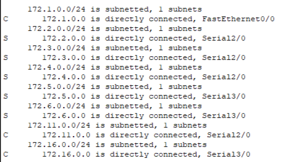
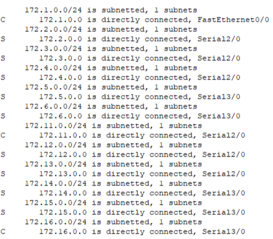
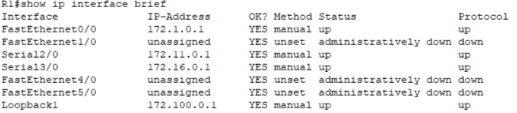

# Лабораторная работа 4. Статическая маршрутизация

Файл стенда: `lab-04.pkt`

## Цель работы

Настроить статическую маршрутизацию между несколькими сетями, проверить таблицы маршрутизации, выполнить `ping` и `tracert`, а также посмотреть поведение сети при отключении одного из интерфейсов.

## Схема



В работе используются шесть маршрутизаторов `R1–R6` и шесть ПК.

Клиентские сети:

| Сеть | Назначение |
|---|---|
| `172.1.0.0/24` | PC1 — R1 |
| `172.2.0.0/24` | PC2 — R2 |
| `172.3.0.0/24` | PC3 — R3 |
| `172.4.0.0/24` | PC4 — R4 |
| `172.5.0.0/24` | PC5 — R5 |
| `172.6.0.0/24` | PC6 — R6 |

Межмаршрутизаторские сети:

```text
172.11.0.0/24
172.12.0.0/24
172.13.0.0/24
172.14.0.0/24
172.15.0.0/24
172.16.0.0/24
172.25.0.0/24
```

## 1. Настройка интерфейсов маршрутизаторов

На каждом маршрутизаторе включаются интерфейсы и назначаются IP-адреса.

Пример настройки:

```ios
interface fa0/0
no shutdown
ip address 172.6.0.1 255.255.255.0

interface se3/0
no shutdown
ip address 172.16.0.6 255.255.255.0

interface se2/0
no shutdown
ip address 172.15.0.6 255.255.255.0
```

После настройки выполняется проверка:

```ios
show ip interface brief
```







Вывод по шагу: используемые интерфейсы должны находиться в состоянии `up/up`, а неиспользуемые могут оставаться `administratively down`.

## 2. Настройка адресации на ПК

Пример для PC1:

```text
IP address: 172.1.0.2
Mask: 255.255.255.0
Gateway: 172.1.0.1
```

Аналогично настраиваются остальные ПК в своих сетях.

## 3. Проверка connected-сетей

До добавления статических маршрутов маршрутизатор знает только сети, подключенные к нему напрямую.

```ios
show ip route
```



Наблюдение: сети с признаком `C` — directly connected, то есть напрямую подключенные сети.

## 4. Настройка статических маршрутов

Статический маршрут добавляется командой:

```ios
ip route <network> <mask> <next-hop или outgoing-interface>
```

Используются маршруты через serial-интерфейсы. Фрагмент:

```ios
ip route 172.100.0.0 255.255.255.0 se2/0
ip route 172.14.0.0 255.255.255.0 se2/0
ip route 172.13.0.0 255.255.255.0 se2/0
ip route 172.11.0.0 255.255.255.0 se3/0
ip route 172.12.0.0 255.255.255.0 se3/0
ip route 172.1.0.0 255.255.255.0 se3/0
ip route 172.16.0.0 255.255.255.0 se3/0
ip route 172.6.0.0 255.255.255.0 se3/0
ip route 172.15.0.0 255.255.255.0 se2/0
```

После настройки проверяется таблица маршрутизации:

```ios
show ip route
```





Маршруты с признаком `S` — статические маршруты.

## 5. Проверка связности

После добавления маршрутов проверяется связность между удаленными сетями.

```text
ping 172.13.0.3
ping 172.14.0.4
ping 172.15.0.5
```

Если ping успешный, значит пакет доходит до удаленной сети, а обратный маршрут также настроен корректно.

## 6. Проверка пути через tracert

Для анализа фактического пути используется `tracert`.

Пример:

```text
tracert 172.13.0.3
1: 172.1.0.1
2: 172.11.0.2
3: 172.13.0.3
```

Еще один пример:

```text
tracert 172.14.0.4
1: 172.1.0.1
2: 172.16.0.6
3: 172.15.0.5
4: 172.14.0.4
```

Вывод: `tracert` показывает, через какие промежуточные маршрутизаторы проходит пакет.

## 7. Проверка loopback/дополнительной сети

Также проверяется интерфейс loopback/дополнительный маршрут.



Смысл проверки: убедиться, что маршрут до дополнительной сети появляется в таблице маршрутизации и может использоваться для проверки достижимости.

## 8. Эксперимент с отключением интерфейса

В работе интерфейс `se2/0` на одном из маршрутизаторов переводился в состояние `down`.

После этого снова проверялись:

```ios
show ip route
```

и связность:

```text
ping
tracert
```

Наблюдение: если существует альтернативный маршрут, трафик может пойти другим путем. Если альтернативный маршрут не задан, связность до части сетей пропадает.

Вывод по эксперименту: статическая маршрутизация требует явного описания резервных путей. Если маршрутизатор не знает, куда отправить пакет, он его отбрасывает.

## Вывод

В ходе работы были настроены IP-адреса интерфейсов маршрутизаторов и статические маршруты до удаленных сетей. После настройки маршрутов была подтверждена связность через `ping`, а фактический путь пакетов был проверен через `tracert`. При отключении интерфейса было показано, что восстановление связности зависит от наличия заранее настроенного альтернативного маршрута.
