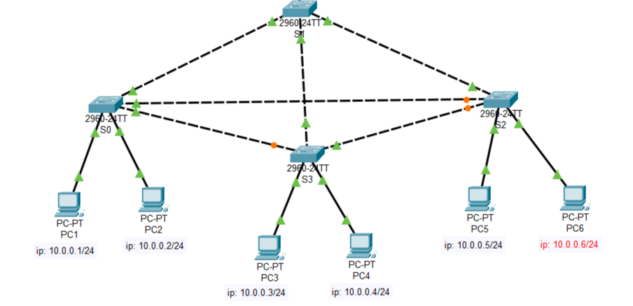
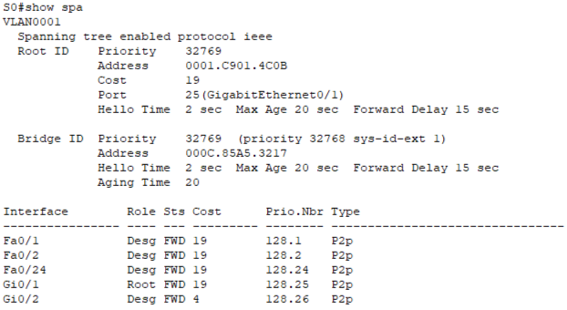
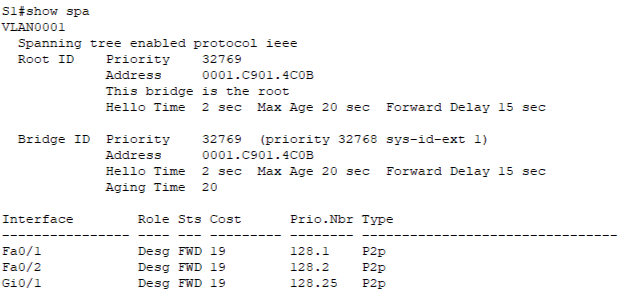
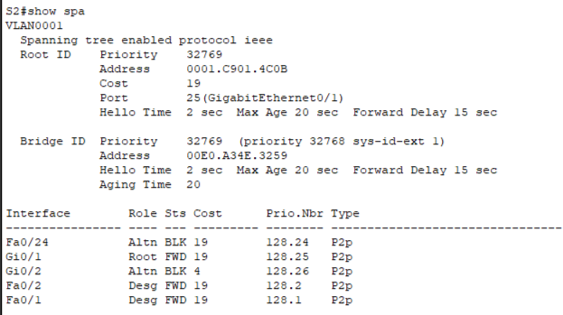
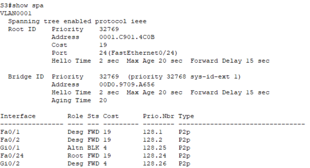
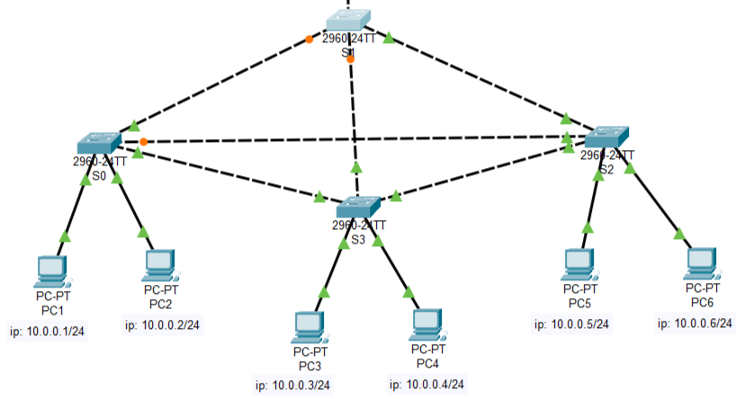
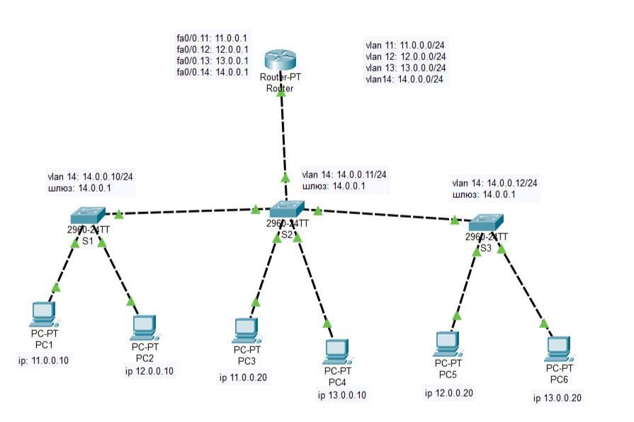

# Лабораторная работа 5. STP и Router-on-a-Stick

Файл стенда: не сохранился.

## Цель работы

Изучить работу Spanning Tree Protocol в сети с избыточными связями: определить root bridge, роли портов, blocked-порты и изменение топологии после отказа связи. Во второй части — настроить маршрутизацию между VLAN по схеме Router-on-a-Stick.

# Часть 1. STP

## 1. Схема STP

В первой части используются коммутаторы `S0–S3` и избыточные связи между ними.



Из-за избыточных связей в L2-сети может возникнуть петля. STP должен выбрать активную древовидную топологию и заблокировать лишние пути.

## 2. Проверка STP на коммутаторах

На каждом коммутаторе выполняется команда:

```ios
show spanning-tree
```

По выводу анализируются:

```text
Root ID
Bridge ID
Cost
Port
Role
Status
```

## 3. Коммутатор S0



По выводу проверяются роли портов и состояние forwarding/blocking. Порт в состоянии `Desg FWD` является designated-портом и участвует в передаче трафика.

## 4. Коммутатор S1



По Bridge ID определяется root bridge. Передача строится относительно корневого коммутатора `S1`.

Вывод: root bridge выбирается по Bridge ID. Чем меньше значение Bridge ID, тем выше шанс стать корневым.

## 5. Коммутатор S2



На `S2` часть портов получила состояние:

```text
Altn BLK
```

Это alternate/blocked-порт. STP заблокировал избыточный путь, чтобы не возникла петля на втором уровне.

## 6. Коммутатор S3



По выводу проверяются роли портов, стоимость пути до root bridge и forwarding-порты.

## 7. Эксперимент: удаление связи между S2 и S1

В работе удалялась связь между `S2` и `S1`.

После изменения топологии схема стала такой:



Наблюдения:

- после удаления связи STP пересчитал дерево;
- порт проходил состояния `listening` и `learning`;
- затем порт переходил в `forwarding`;
- новый путь выбирался по стоимости пути и приоритету порта;
- у Gigabit-интерфейса стоимость ниже, чем у FastEthernet.

Пример пути после изменения:

```text
PC6 -> S2 -> S3 -> S1 -> S0 -> PC2
```

Вывод: STP перестраивает активную топологию после отказа связи, но переключение происходит не мгновенно.

# Часть 2. Межвлановая маршрутизация Router-on-a-Stick

## 8. Схема межвлановой маршрутизации

Во второй части маршрутизатор подключен к коммутатору одним физическим интерфейсом, а на маршрутизаторе создаются subinterface для каждой VLAN.



## 9. VLAN-сети

| VLAN | Сеть | Gateway/subinterface |
|---|---|---|
| VLAN 11 | `11.0.0.0/24` | `11.0.0.1` |
| VLAN 12 | `12.0.0.0/24` | `12.0.0.1` |
| VLAN 13 | `13.0.0.0/24` | `13.0.0.1` |
| VLAN 14 | `14.0.0.0/24` | `14.0.0.1` |

## 10. Создание VLAN на коммутаторе

```ios
vlan 11
vlan 12
vlan 13
vlan 14
```

Порты к ПК переводятся в access-режим и назначаются в нужные VLAN.

```ios
interface fa0/1
switchport mode access
switchport access vlan 11
```

## 11. Настройка trunk до маршрутизатора

Порт коммутатора, ведущий к маршрутизатору, настраивается как trunk.

```ios
interface gi0/1
switchport mode trunk
switchport trunk allowed vlan 11-14
```

Проверка:

```ios
show interface trunk
show vlan brief
```

## 12. Настройка subinterface на маршрутизаторе

Физический интерфейс включается:

```ios
interface fa0/0
no shutdown
```

Затем настраиваются subinterface для VLAN:

```ios
interface fa0/0.11
encapsulation dot1q 11
ip address 11.0.0.1 255.255.255.0

interface fa0/0.12
encapsulation dot1q 12
ip address 12.0.0.1 255.255.255.0

interface fa0/0.13
encapsulation dot1q 13
ip address 13.0.0.1 255.255.255.0

interface fa0/0.14
encapsulation dot1q 14
ip address 14.0.0.1 255.255.255.0
```

Проверка:

```ios
show ip route
show running-config
```

## 13. Проверка связи между VLAN

После настройки выполняется ping между устройствами из разных VLAN.

Ожидаемый результат: трафик между VLAN теперь проходит через маршрутизатор, потому что для каждой VLAN есть свой subinterface и default gateway.

## Вывод

В первой части изучена работа STP: root bridge, роли портов и blocked-порты. Показано, что STP предотвращает L2-петли и перестраивает топологию после отказа связи. Во второй части настроена межвлановая маршрутизация Router-on-a-Stick: trunk до маршрутизатора и subinterface с `encapsulation dot1q` позволяют передавать трафик между VLAN.
