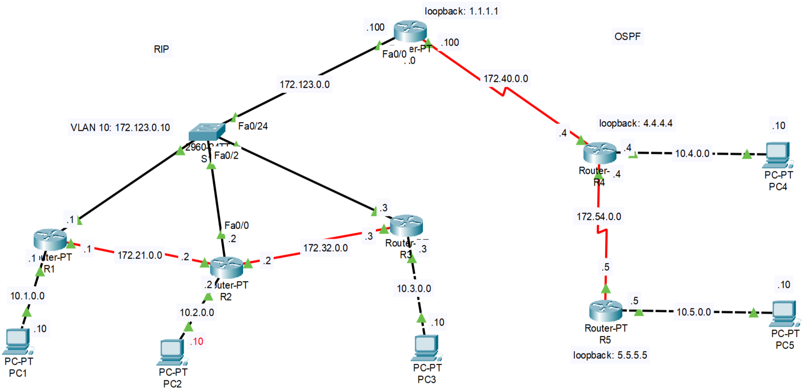
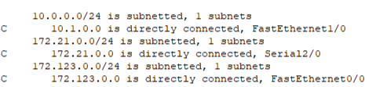
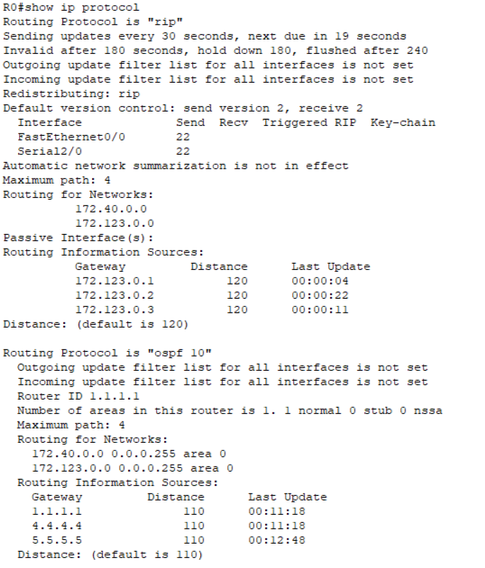
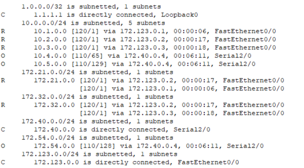
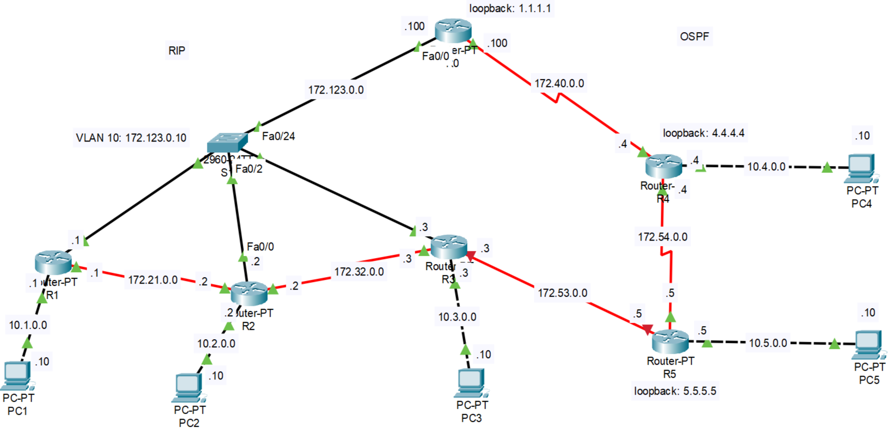

# Лабораторная работа 6. RIP, OSPF и перераспределение маршрутов

Файл стенда: `lab-06.pkt`

## Цель работы

Настроить динамическую маршрутизацию: RIP в одной части сети, OSPF в другой части сети, loopback-интерфейсы для router-id и обмен маршрутами между RIP и OSPF через redistribution.

## 1. Схема сети

Левая часть сети работает на RIP, правая часть — на OSPF. Между ними находится пограничный маршрутизатор, на котором выполняется перераспределение маршрутов.



## 2. Исходные данные

RIP-сегмент:

| Устройство/сеть | Адресация |
|---|---|
| PC1 | `10.1.0.10/24`, gateway `10.1.0.1` |
| PC2 | `10.2.0.10/24`, gateway `10.2.0.1` |
| PC3 | `10.3.0.10/24`, gateway `10.3.0.1` |
| R1-R2 | `172.21.0.0/24` |
| R2-R3 | `172.32.0.0/24` |
| общий сегмент через S1 | `172.123.0.0/24` |

OSPF-сегмент:

| Устройство/сеть | Адресация |
|---|---|
| R0 loopback | `1.1.1.1` |
| R4 loopback | `4.4.4.4` |
| R5 loopback | `5.5.5.5` |
| R0-R4 | `172.40.0.0/24` |
| R4-R5 | `172.54.0.0/24` |
| PC4-сеть | `10.4.0.0/24` |
| PC5-сеть | `10.5.0.0/24` |

## 3. Настройка адресации

На маршрутизаторах включаются интерфейсы и назначаются IP-адреса.

Пример:

```ios
interface fa0/0
no shutdown
ip address 172.123.0.1 255.255.255.0
```

На начальном этапе маршрутизатор знает только directly connected сети.

```ios
show ip route
```



Вывод: маршруты с признаком `C` — напрямую подключенные сети.

## 4. Настройка loopback-интерфейсов

Loopback используется как стабильный адрес для router-id.

```ios
interface loopback 0
ip address 4.4.4.4 255.255.255.255
```

Наблюдение: при запуске OSPF генерируется router-id. По умолчанию берется наибольший адрес loopback-интерфейса, а если loopback-интерфейс не настроен — наибольший IP-адрес активного физического интерфейса.

## 5. Настройка OSPF

В OSPF-сегменте запускается процесс:

```ios
router ospf 10
```

Далее добавляются сети:

```ios
network <network> <wildcard-mask> area 0
```

Проверка:

```ios
show ip protocols
show ip ospf neighbor
show ip route
```

## 6. Настройка RIP

В RIP-сегменте запускается RIP и добавляются сети.

```ios
router rip
version 2
network 172.123.0.0
network 172.21.0.0
network 172.32.0.0
network 10.1.0.0
network 10.2.0.0
network 10.3.0.0
no auto-summary
```

По выводу `show ip protocols` видно, что RIP отправляет обновления каждые 30 секунд, а administrative distance равна 120.



## 7. Redistribution между RIP и OSPF

На пограничном маршрутизаторе выполняется обмен маршрутами между двумя протоколами.

Общая логика:

```ios
router ospf 10
redistribute rip subnets

router rip
redistribute ospf 10 metric <metric>
```

После этого в таблицах маршрутизации появляются маршруты разных типов:

| Обозначение | Значение |
|---|---|
| `C` | directly connected |
| `R` | RIP |
| `O` | OSPF |
| `O E2` | внешний OSPF-маршрут после redistribution |

Проверка таблицы маршрутизации после настройки:



## 8. Проверка связности

После настройки RIP, OSPF и redistribution выполняется ping между сетями, находящимися в разных routing domain.

Смысл проверки: убедиться, что RIP-сегмент знает маршруты OSPF-сегмента, а OSPF-сегмент знает маршруты RIP-сегмента.

## 9. Эксперимент с изменением топологии

В работе отключался интерфейс на одном из маршрутизаторов. После этого проверялось, как изменилась таблица маршрутизации и осталась ли сеть достижимой через другой путь.

Схема после изменения:



Наблюдение: часть сети стала доступна через другой интерфейс. Динамическая маршрутизация позволила перестроить маршрут без ручного прописывания каждого статического маршрута.

## Вывод

Освоена настройка RIP и OSPF, использование loopback-интерфейсов для стабильного router-id, а также перераспределение маршрутов между разными протоколами. После настройки redistribution маршруты из RIP и OSPF стали видны в общей таблице маршрутизации. При изменении топологии динамическая маршрутизация позволяет сети перестраиваться.
