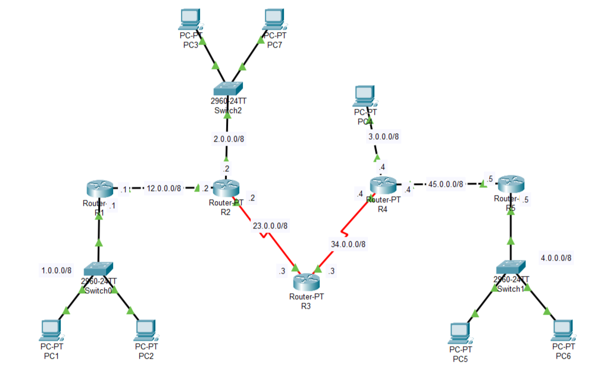
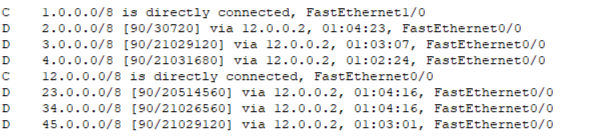
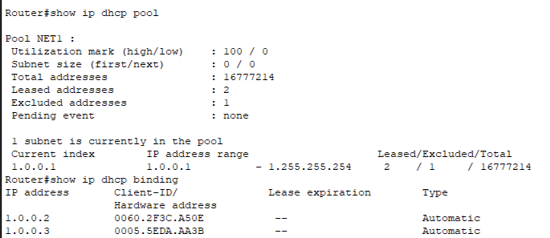
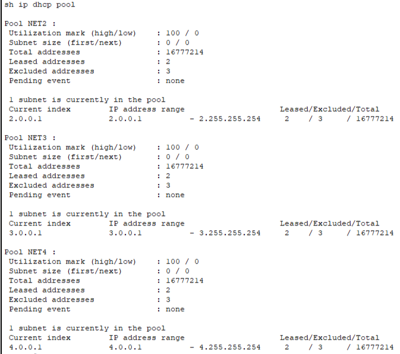
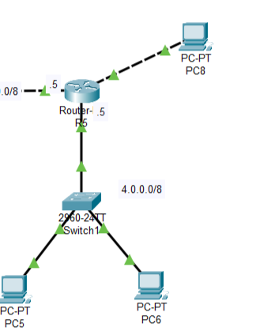

# Лабораторная работа 7. DHCP и EIGRP

Файл стенда: `lab-07.pkt`

## Цель работы

Настроить DHCP для автоматической выдачи IP-адресов клиентским устройствам и EIGRP для маршрутизации между сетями. Проверить DHCP pools, excluded addresses, leased addresses и маршруты EIGRP.

## 1. Схема сети



В работе используются пять маршрутизаторов `R1–R5`, несколько клиентских сетей и EIGRP-маршрутизация.

Основные сети:

```text
1.0.0.0/8
2.0.0.0/8
3.0.0.0/8
4.0.0.0/8
12.0.0.0/8
23.0.0.0/8
34.0.0.0/8
45.0.0.0/8
```

## 2. Настройка интерфейсов маршрутизаторов

На маршрутизаторах включаются интерфейсы и назначаются IP-адреса.

Пример для R1:

```ios
interface fa0/0
no shutdown
ip address 12.0.0.1 255.0.0.0

interface fa1/0
no shutdown
ip address 1.0.0.1 255.0.0.0
```

Проверка:

```ios
show ip interface brief
```

## 3. Настройка EIGRP

На маршрутизаторах запускается EIGRP.

```ios
router eigrp <AS>
network <network>
no auto-summary
```

После настройки проверяется таблица маршрутизации:

```ios
show ip route
```

В таблице маршруты EIGRP отмечаются буквой `D`.



Пример маршрутов:

```text
D 2.0.0.0/8 via 12.0.0.2
D 3.0.0.0/8 via 12.0.0.2
D 4.0.0.0/8 via 12.0.0.2
D 23.0.0.0/8 via 12.0.0.2
D 34.0.0.0/8 via 12.0.0.2
D 45.0.0.0/8 via 12.0.0.2
```

Вывод по шагу: EIGRP распространил маршруты до удаленных сетей.

## 4. Настройка DHCP pool

На маршрутизаторе создается DHCP pool для клиентской сети.

Пример для сети `3.0.0.0/8`:

```ios
ip dhcp pool NET3.0
network 3.0.0.0 255.0.0.0
default-router 3.0.0.5
```

Для адресов, которые не должны выдаваться клиентам, задаются исключения:

```ios
ip dhcp excluded-address <start-ip> <end-ip>
```

Проверка конкретного пула:



Проверка всех DHCP pools:



Фрагмент:

| Pool | Сеть | Leased addresses | Excluded addresses |
|---|---|---:|---:|
| NET1 | `1.0.0.0/8` | 2 | 1 |
| NET2 | `2.0.0.0/8` | 3 | 3 |
| NET3 | `3.0.0.0/8` | 2 | 3 |
| NET4 | `4.0.0.0/8` | 2 | 3 |

## 5. Проверка клиента DHCP

Клиент переводится в режим DHCP.

До получения адреса:

```text
IP: 0.0.0.0
Mask: 0.0.0.0
```

После получения адреса:

```text
IP: 3.0.0.2
Mask: 255.0.0.0
Gateway: 3.0.0.4
```

Фрагмент проверки для сети NET4:



Вывод: DHCP корректно выдает клиенту IP-адрес, маску и default gateway.

## 6. Добавление нового DHCP pool

В работе добавлялся новый пул `NET3.0`. После настройки клиент получил адрес из нужной сети.

```ios
ip dhcp pool NET3.0
network 3.0.0.0 255.0.0.0
default-router 3.0.0.4
```

Проверка:

```ios
show ip dhcp pool
```

Наблюдение: после добавления пула количество leased addresses изменяется, а клиент получает корректные параметры.

## 7. Совместная проверка DHCP и EIGRP

После получения адреса по DHCP проверяется связность до удаленных сетей. EIGRP обеспечивает маршруты между сетями, а DHCP выдает клиентам адреса и шлюз.

Команды проверки:

```ios
show ip route
show ip dhcp pool
show ip dhcp binding
```

## Вывод

DHCP автоматизирует выдачу IP-параметров клиентским устройствам, а EIGRP обеспечивает маршрутизацию между удаленными сетями. В работе проверены DHCP pools, исключенные адреса, leased addresses и маршруты EIGRP. После настройки клиент получает адрес автоматически и сохраняет связность с удаленными сегментами сети.
